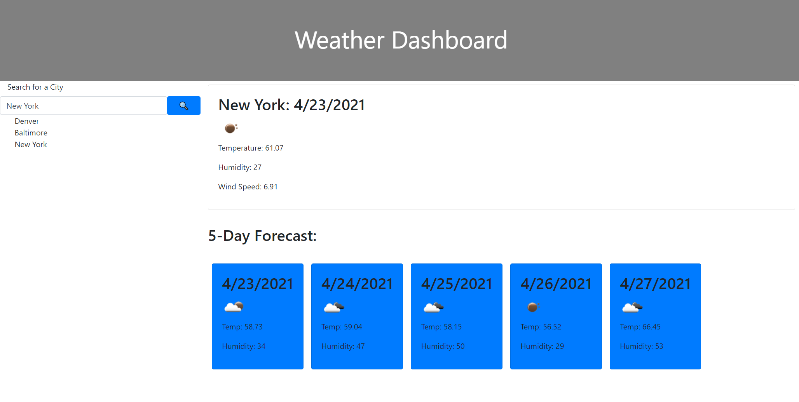
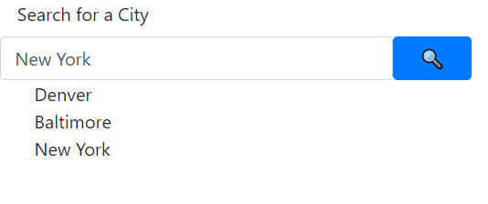

# Weather-Dashboard

Title: Weather Dashboard
Author: Tyler Fabian
GitHub hosted page: https://tylerf808.github.io/Weather-Dashboard/

Overview: This application fetches weather data for any city that is typed into the search box. It will also keep track of previous searches and allows you to pull up the data from those searches by clicking on them in the history section.

Instructions: 
1. Enter a city into the search bar. 
2. Click search. The current day data will update, as well as the five day forecast. You will also see your city pop up in the search history. 
3. Hover over a previous search and click to pull up that data again.